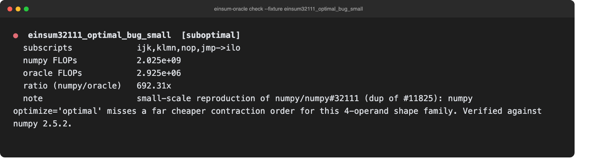

# einsum-oracle

An independent, exact dynamic-programming oracle for tensor-contraction
order, used to check whether `numpy.einsum_path`'s `optimize='optimal'`
search actually found the true minimum-FLOP contraction plan.



## Why this exists

[numpy/numpy#11825](https://github.com/numpy/numpy/issues/11825) (open
since 2018) and its 2026 duplicate report
[numpy/numpy#32111](https://github.com/numpy/numpy/issues/32111) describe a
real, independently reproducible defect: for certain 4-operand einsum
expressions, `numpy.einsum_path(..., optimize='optimal')` returns a plan
that is **orders of magnitude** more expensive than the true optimum,
*without any warning*. `opt_einsum` (an optional third-party dependency)
finds the correct plan on the same input.

This tool does not patch numpy or depend on `opt_einsum`. It implements a
from-scratch exact solver (bitmask dynamic programming over subsets of
operands — the standard textbook algorithm for optimal matrix-chain /
tensor-contraction ordering) and compares numpy's own reported "Optimized
FLOP count" against the true minimum for the same expression and shapes.
This gives an independent, verifiable answer to "is numpy's plan actually
optimal here?" without trusting numpy's own optimizer to grade its own
homework.

## Verified reproduction

Confirmed independently reproducible on **numpy 2.5.2** (2026-09-17, this
repository's CI) using the exact shape family from the original issue
report. A scaled-down version of the same shapes runs in CI as
`einsum32111_optimal_bug_small`:

```
$ einsum-oracle check --fixture einsum32111_optimal_bug_small
● einsum32111_optimal_bug_small  [suboptimal]
  subscripts             ijk,klmn,nop,jmp->ilo
  numpy FLOPs            2.025e+09
  oracle FLOPs           2.925e+06
  ratio (numpy/oracle)   692.31x
  note                   small-scale reproduction of numpy/numpy#32111 ...
```

The full original-issue scale (`r=150, n=5000`) reproduces a ~87,000x gap
(fixture `einsum32111_optimal_bug_original_scale`, not run in CI by default
since it allocates large arrays purely for shape metadata — run it manually
to see the literal headline numbers from the GitHub issue).

**If this test starts failing** (i.e. `test_numpy_32111_regression_still_reproducible`
starts reporting `verdict == "optimal"`), that means numpy has fixed the
underlying search defect upstream — treat that as good news, not a bug in
this tool, and update the fixture status accordingly.

## Install and run

Requires Python 3.9+ and numpy; no GPU, no optional `opt_einsum` dependency.

```bash
git clone https://github.com/zhuhroscar-tech/einsum-oracle.git
cd einsum-oracle
python3 -m venv .venv
source .venv/bin/activate
python -m pip install -e ".[dev]"
```

```bash
einsum-oracle check                      # run every fixture
einsum-oracle check --fixture chain_matmul_4
einsum-oracle check --json --no-color
einsum-oracle list-fixtures
```

Exits `0` if every checked fixture's plan is within the optimality
threshold (default ratio 8x), `1` if any fixture is flagged `suboptimal`
or errors.

## Using the oracle directly

```python
from einsum_oracle.compare import check_path

result = check_path("ij,jk,kl->il", [(10, 2), (2, 20), (20, 3)])
print(result.verdict, result.ratio)
```

`einsum_oracle.oracle.optimal_contraction()` is the standalone exact
solver, usable independently of numpy's einsum_path if you just want a
provably-optimal contraction order for up to ~12 operands (the DP is
`O(3^n)` over operand subsets — exact but exponential, a correctness
oracle for spot-checking, not a production-scale planner for large tensor
networks).

## Limits

- The exact DP is `O(3^n)` in the number of operands; `max_operands=12`
  (default) keeps every check well under a second, but this is not a
  substitute for a production contraction-path planner (like `opt_einsum`)
  on large tensor networks with dozens of operands.
- The cost model counts one multiply per scalar FLOP across the union of
  labels in a pairwise merge — the standard convention used in numpy's own
  `einsum_path` docstring — but numpy's own reported FLOP counts run at a
  small, consistent multiple of this (~1.6x–2.0x observed) due to its own
  internal accounting convention. The `suboptimal_ratio_threshold` (default
  8x) is set well above that baseline noise and well below the 100x+ ratios
  a genuine missed-path defect produces, but it is a heuristic threshold,
  not a formal proof boundary.
- This tool identifies *that* a plan is suboptimal and by how much; it does
  not itself provide a corrected contraction plan for use in production
  code (use `opt_einsum` for that, once you know to reach for it).
- Ellipsis (`...`) and implicit-output subscripts are not supported —
  only explicit `"...,...->..."` subscript strings.

## Development

```bash
python -m pip install -e ".[dev]"
python -m pytest -v --cov=einsum_oracle --cov-report=term-missing
```
